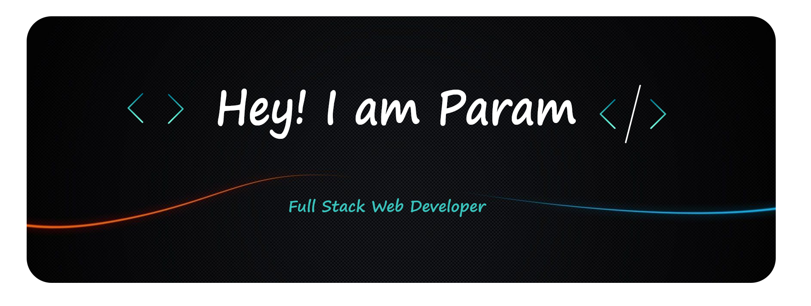

🔴🟡🟢

 

  

## 🧭 &nbsp;About Me

- 📚 Final year B.Tech student at NIT Jalandhar.
<!-- - 🔭 I'm currently working on <a href="#">MyJob</a> -->

- 🌱 Full Stack web-developer.

- 💬 Belongs to PB-03 , **INDIA** .

- 📫 How to reach me param11650@gmail.com
<!-- - ⚡ Fun fact: I'm a <a href="https://en.wikipedia.org/wiki/Potato">potato</a> -->

   

`Developer and IT enthusiast`
 

`=========================`
 

`¯\_(ツ)_/¯`

 <!--h1 without bottom border-->

  <ul align="center">
    
<h2 style="display: inline-block">Technologies That I Know👨🏻‍💻</h2>

  </ul>

<!--tech stack icons-->

  

 

## 📊 &nbsp;My activities

  
  

